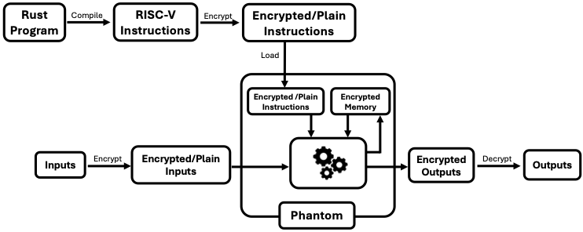

# Phantom

Phantom is a fully encrypted RISC-V virtual machine that executes encrypted RISC-V binaries on encrypted inputs.

It enables black-box execution of any RISC-V program, allowing developers to write code with hidden instructions, constants, states, and make its encrypted version public. The encrypted version can then be executed on any arbitrary encrypted inputs using the Phantom VM.

<p align="center">
  
</p>

## Building Phantom

We provide a setup script at [setup.sh](./setup.sh) to build Phantom and required dependencies from scratch on a fresh Debian/Ubuntu machine.

## How to use Phantom

Developers write their programs in Rust, which are then compiled into RISC-V binaries. These binaries are transformed into a polynomial representation, optimized for execution within the plaintext space of RLWE-based FHE.
These polynomials are then encrypted, producing the encrypted program, which can then be executed by the Phantom VM on arbitrary encrypted and/or plaintext inputs.

To use, we recommend to look at full end to end examples in `compiler-tests` directory. In particular, the [template](./compiler-tests/otc/) example to start programming in Phantom, and [otc](./compiler-tests/otc/) for a more advanced example.

## Architecture

Phantom VM is a collection of FHE circuits that collectively simulate a RISC-V virtual machine.
The Phantom VM is implemented in the `./fhevm` directory.
The architecture of the Phantom VM is described in [doc/spec.png](./doc/spec.png).
It consists of 6 major components:
- Reading the instruction components from the ROM
- Reading the registers
- Reading the RAM
- Updating the registers
- Updating the RAM
- Updating the PC

The dependency graph of the operations performed in these components is described in [doc/costs.md](./doc/costs.md), which shows how Phantom can be further parallelized.

## Benchmark

We benchmark Phantom on a AWS r6i.metal, parallelized with 32 threads and measure the runtime of a single cycle, and all 6 components.

Average Cycle Time: 655 ms
  1. Read and prepare instruction components: 128 ms
     - Read instruction components: 28 ms
     - Prepare instruction components: 100 ms
  2. Read and prepare registers: 106 ms
     - Read registers: 7 ms
     - Prepare registers: 98 ms
  3. Read ram: 71 ms
  4. Update registers: 203 ms
     - Evaluate rd ops: 133 ms
     - Blind selection: 1 ms
     - Write rd: 69 ms
  5. Update ram: 72 ms
  6. Update pc: 73 ms
     - PC update BDD: 18 ms
     - PC prepare: 54 ms

To reproduce benchmarks for a single cycle, run:
```
cargo bench --package fhevm --bench cycle
```

## Contribute

