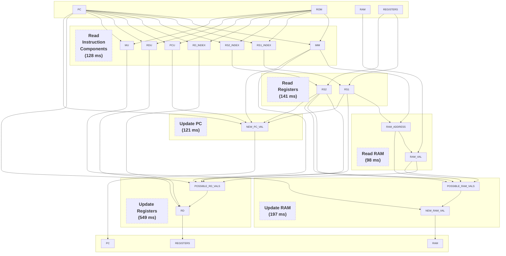

<!-- 
- Use PC to read instruction components from ROM (IMM, RS1_INDEX, RS2_INDEX, RD_INDEX, PCU, RDU, MU)
- Read registers (RS1_INDEX -> RS1, RS2_INDEX -> RS2)
- Prepare all values for evaluation (IMM, RS1, RS2)
- Compute ram address (IMM, RS1 -> RAM_ADDRESS) and read ram at ram address (RAM_ADDRESS, RAM -> RAM_VAL)
- Compute possible new value of RD (IMM, RS1, RS2, IMM, PC, RAM_VAL -> POSSIBLE_RD_VALS)
- Blind select correct rd value (RDU, POSSIBLE_RD_VALS -> NEW_RD_VAL)
- Put the rd value in rd (RD_INDEX, NEW_RD_VAL -> RD)
-  -->

<!--
Average Cycle Time: 1.55773912s
  1. Read instruction components: 128.317183ms
  2. Read registers: 141.108799ms
  3. Prepare imm rs1 rs2 values: 321.63368ms
  4. Read ram: 98.038346ms
  5. Update registers: 549.759557ms
     - Evaluate rd ops: 306.301296ms
     - Blind selection: 66.950837ms
     - Write rd: 176.506174ms
  6. Update ram: 197.162751ms
  7. Update pc: 121.582101ms
     - PCU prepare: 62.835836ms
     - PC update BDD: 58.745625ms
-->

Below is the dependency of one cycle in Phantom.
It shows how each intermediate value in Phantom is computed and which other values it depends on.
A single cycle starts at top and ends at the bottom.
Operation blocks at same level are processed in parallel, thus the total cycle time equals summation of time take by each block on longest path.

The runtimes are from running Phantom on a AWS m6a.8xlarge, parallelized with 32 threads.
Runtimes are subject to improvement and may vary, depending on the hardware.

## Summary of runtime
The runtimes are from running Phantom on a AWS m6a.8xlarge, parallelized with 32 threads.

Average Cycle Time: 1.55773912s
  1. Read instruction components: 128.317183ms
  2. Read registers: 141.108799ms
  3. Prepare imm rs1 rs2 values: 321.63368ms
  4. Read ram: 98.038346ms
  5. Update registers: 549.759557ms
     <!-- - Evaluate rd ops: 306.301296ms
     - Blind selection: 66.950837ms
     - Write rd: 176.506174ms -->
  6. Update ram: 197.162751ms
  7. Update pc: 121.582101ms
     <!-- - PCU prepare: 62.835836ms
     - PC update BDD: 58.745625ms -->

<!-- 
Dependency graph of operations in risc-v FHE-VM. A single cycle starts at top and ends at the bottom. Operation blocks at same level are processed in parallel, thus the total cycle time equals summation of time take by each block on longest path.

 

-   Note that the figures are rough estimations and runtime in practice will deviate.
-   The time per cycle is total time of the longest path.
    -   Single cycle cost for rv32i = 530ms
    -   Single cycle cost for rv32im (i.e. with "M" extension) = 4010ms
        -   u32 Div/Rem instructions take approx. 3.5s.
-   Reference notes:
    -   BR stands for blind rotation. Blind rotation approx. takes 20ms on CPU.
    -   CBT stands for circuit bootstrapping. CBT requires $d$ blind rotations, where $d$ is decomposition count of desired RGSW ciphertext. BRs of single CBT can be processed in parallel
    -   Cost for arithmetic operations on u32 are taken from this [link](https://docs.zama.ai/tfhe-rs/get-started/benchmarks).
-   Questions:
    -   Are there alternative integer representations in which Div/Rem are less expensive? -->
