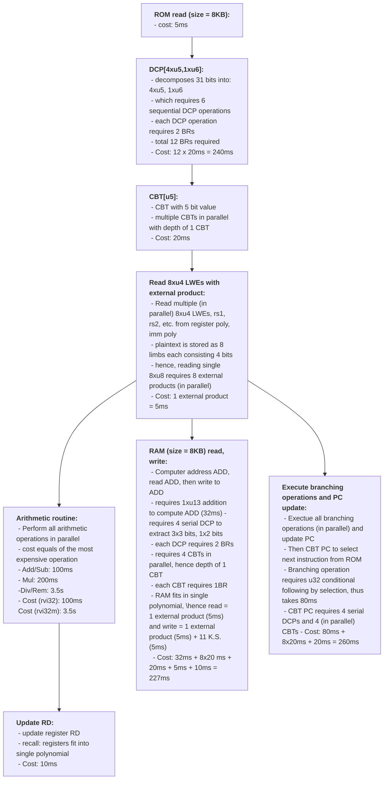

Dependency graph of operations in risc-v FHE-VM. A single cycle starts at top and ends at the bottom. Operation blocks at same level are processed in parallel, thus the total cycle time equals summation of time take by each block on longest path.

 

-   Note that the figures are rough estimations and runtime in practice will deviate.
-   The time per cycle is total time of the longest path.
    -   Single cycle cost for rv32i = 530ms
    -   Single cycle cost for rv32im (i.e. with "M" extension) = 4010ms
        -   u32 Div/Rem instructions take approx. 3.5s.
-   Reference notes:
    -   BR stands for blind rotation. Blind rotation approx. takes 20ms on CPU.
    -   CBT stands for circuit bootstrapping. CBT requires $d$ blind rotations, where $d$ is decomposition count of desired RGSW ciphertext. BRs of single CBT can be processed in parallel
    -   Cost for arithmetic operations on u32 are taken from this [link](https://docs.zama.ai/tfhe-rs/get-started/benchmarks).
-   Questions:
    -   Are there alternative integer representations in which Div/Rem are less expensive?
